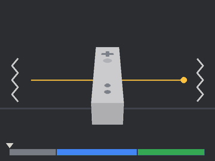
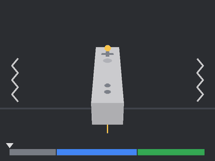
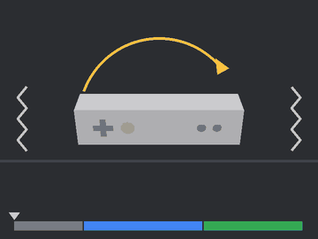

# WiiChinaHook

*[English](README.md) · Español*

Aplicación experimental para Windows que conecta hasta cuatro Wiimotes (incluidos
clones con MotionPlus integrado) y publica controles/movimiento por DSU y datos Wii
completos por una API WebSocket local. No requiere ejecutar Dolphin. Dos modos de conexión:

| Modo | Hardware | Uso |
|---|---|---|
| `dolphinbar` (por defecto) | Mayflash DolphinBar en **modo 4** | El Bluetooth del PC sigue libre para Windows |
| `bluetooth` | Adaptador USB Bluetooth con **libusbK** (p. ej. Intel `8087:0A2A`) | Passthrough propio con Bumble; el adaptador queda reservado mientras funciona |

Una app gráfica (Flet) configura ambos modos y muestra cada mando en vivo, incluida
una vista 3D de la orientación del Wiimote. También envía los mandos a Dolphin y Cemu
por DSU ([guía de Dolphin](docs/guides/dolphin.es.md),
[guía de Cemu](docs/guides/cemu.es.md)) o los convierte en mandos Xbox virtuales.

**Probado en Windows 11 de 64 bits (x64).** No se ha probado en otras versiones de
Windows.

## Descarga

Descarga `WiiChinaHook-<versión>-win64.zip` desde la
[página de Releases](https://github.com/angelopol/WiiChinaHook/releases). Descomprímelo
donde quieras (p. ej. `C:\Apps\WiiChinaHook`) y ejecuta `WiiChinaHook.exe`. No necesita
Python. Los ajustes se guardan en `%APPDATA%\WiiChinaHook`. Los modos Xbox necesitan
además el controlador [ViGEmBus](https://github.com/nefarius/ViGEmBus/releases). El
ejecutable no está firmado, así que Windows SmartScreen puede avisar la primera vez
(*Más información* → *Ejecutar de todas formas*). Cada release indica el SHA-256 del zip
para comprobar la descarga.

**Las releases se publican solas.** Sube la versión en `src/wiichinahook/__init__.py` y
`pyproject.toml` (la misma en ambos, p. ej. `0.3.1`) y haz push a `main`. El
[flujo Release](.github/workflows/release.yml) detecta una versión sin etiqueta y:

1. ejecuta las pruebas;
2. compila el ejecutable con `tools/build_release.ps1`;
3. crea la etiqueta `v0.3.1` en ese commit;
4. publica la release de GitHub con el zip, su SHA-256 y los cambios desde la anterior.

Los push que no cambian la versión no publican nada. Las versiones como `0.4.0rc1` se
publican como pre-release. El flujo [CI](.github/workflows/ci.yml) ejecuta las pruebas en
cada push y pull request. Para compilarlo en local: `pip install -e .[gui,release]` y
después `powershell -ExecutionPolicy Bypass -File tools\build_release.ps1`.

## Instalación desde el código fuente

Probado con Python 3.13 x64. Se requiere Python 3.11 o posterior.

```powershell
py -3.13 -m venv .venv
.venv\Scripts\python -m pip install -r requirements.lock.txt
.venv\Scripts\python -m pip install -e . --no-deps
```

`requirements.lock.txt` incluye la GUI. Solo para consola, instala con
`pip install -e .`; añade la GUI después con `pip install -e .[gui]`.

Cierra Dolphin antes de usar WiiChinaHook: solo un programa debe controlar la
DolphinBar o el adaptador. Para volver a Dolphin, detén el servicio.

## App gráfica

```powershell
.venv\Scripts\python wiichinahook.py gui
```

- **Mandos:** una tarjeta por slot con botones, acelerómetro, velocidad de giro del
  MotionPlus, puntero IR, stick y acelerómetro del Nunchuk, batería y una vista de **Orientación**:
  un Wiimote 3D que sigue al mando real (MotionPlus + gravedad). La dirección no tiene
  referencia absoluta y deriva poco a poco; **Recentrar** convierte la dirección
  actual en "apuntando a la pantalla" (plano) o "botones hacia ti" (agarre de lado).
  Sin MotionPlus solo se muestra la inclinación. Vibración, LEDs, calibración del
  sesgo del giroscopio, calibración de escala del MotionPlus y olvidar están a un clic;
  en modo Bluetooth aparece un panel de emparejamiento. Cada tarjeta incluye además los
  interruptores por mando de **calibración rápida** y **calibración con la barra
  sensora** (ver más abajo).
- **Icono de la bandeja:** la app vive en el área de notificación (junto al reloj). Un
  clic en el icono abre la ventana. Con clic derecho puedes abrirla, cambiar el modo
  (1–4) o salir. Cerrar la ventana deja la app funcionando en la bandeja. Para salir,
  usa *Salir*.
- **Ajustes → Aplicación:** *Iniciar con Windows* (entrada de inicio del usuario, sin
  permisos de administrador; arranca oculta en la bandeja), *Iniciar minimizada en la
  bandeja*, *Cerrar la ventana la deja en la bandeja* e *Iniciar el servicio al abrir
  la app*.
- **Ajustes:** modo de conexión, puertos DSU/API, IR y MotionPlus, guardados en
  `config.local.json`. En modo Bluetooth la app lista los adaptadores con controlador
  libusbK/WinUSB; si no hay ninguno, explica cómo instalarlo con Zadig y ofrece
  abrirlo o descargarlo. **Controlador del adaptador** cambia un adaptador entre libusbK
  y su controlador Bluetooth de Windows sin Zadig (ver más abajo).
- **Mando Xbox:** modo activo, modificador de modo, un dibujo en vivo del mando Xbox
  virtual de cada Wiimote (los botones pulsados se iluminan, los gatillos se llenan y los
  sticks se mueven) y remapeo libre de cada control Xbox en cada uno de los cuatro modos
  (ver más abajo). Cada modo es Vacío, Xbox o DSU; un modo DSU muestra en la propia
  pestaña los nombres de las entradas DSU y las guías de Dolphin y Cemu.
- **Registro:** registro del servicio en vivo; **Guardar log…** lo escribe en un archivo `.log` en la carpeta que elijas.
- Interfaz en inglés y español (selector de idioma en la cabecera).

La GUI ejecuta el servicio en su propio proceso y lo detiene al cerrar la ventana. Si
ya hay un servicio en marcha (por ejemplo `hook` desde la consola), se conecta a él.

## Uso con la DolphinBar (modo por defecto)

1. Pon la DolphinBar en **modo 4** (botón de modo hasta encender el LED 4). En ese
   modo Windows ve cuatro dispositivos HID `057E:0306`, uno por ranura.
2. Empareja cada mando en la barra: SYNC en la barra y después SYNC en el mando.
3. Arranca el servicio y consulta el estado:

```powershell
.venv\Scripts\python wiichinahook.py hook
.venv\Scripts\python wiichinahook.py devices
.venv\Scripts\python wiichinahook.py calibrate --slot 0
```

La ranura de la barra (0–3) es el slot de la app; un mando conectado se detecta en
unos dos segundos y su desaparición en unos diez. `pair` no se usa en este modo.
`calibrate` mide el sesgo del giroscopio (mando inmóvil) y lo guarda por ranura en
`.wiichinahook/dolphinbar.json`; `forget --slot N` borra esos ajustes, no el
emparejamiento de la barra.

La barra descarta las respuestas de lectura de memoria de los clones, así que la app
inicializa sin leer: detecta el Nunchuk por el reporte de estado y el MotionPlus por
el formato de sus datos. La calibración del acelerómetro usa valores típicos
(cero `0x80`, 1 g `0x9a`, los de fábrica del clon validado) y la del MotionPlus es
nominal más el sesgo de `calibrate`. La barra no revela la dirección Bluetooth del
mando: DSU publica una MAC local fija por ranura (`02:00:44:42:00:0N`).

## Uso con Bluetooth passthrough (`--mode bluetooth`)

El adaptador de referencia es Intel `8087:0A2A` con **libusbK 3.1.0.0**; mientras
tenga ese controlador, Windows no puede usarlo como Bluetooth normal. Instala el
controlador con [Zadig](https://zadig.akeo.ie/): *Options → List All Devices*, elige
el adaptador, selecciona libusbK y pulsa *Replace Driver*.

En una terminal:

```powershell
.venv\Scripts\python wiichinahook.py hook --mode bluetooth
```

O fija `"mode": "bluetooth"` en `config.local.json`. En otra terminal, abre una
ventana de sincronización y pulsa el botón rojo **SYNC**:

```powershell
.venv\Scripts\python wiichinahook.py pair --seconds 30
.venv\Scripts\python wiichinahook.py devices
.venv\Scripts\python wiichinahook.py monitor
```

Para conectar mediante **1 + 2**, usa `pair --mode temporary`. En este modo el PIN
usa la dirección del mando; SYNC usa la dirección del host. Si conoces la MAC,
`pair --address XX:XX:XX:XX:XX:XX` evita depender del descubrimiento.
La búsqueda automática considera nombre/clase de dispositivo: revisa `devices`
y usa dirección explícita si hay otros periféricos Bluetooth cerca. Mientras hay una
ventana de emparejamiento abierta se pausan los intentos de reconexión.

Repite la sincronización para los demás mandos. Se guardan slots `0–3`, claves de
enlace por adaptador y calibración manual. Los mandos conocidos se reconectan
al encenderlos (pulsando un botón); el mando debe conservar el vínculo (SYNC, no
modo temporal).

```powershell
.venv\Scripts\python wiichinahook.py led --slot 0 --mask 0x10
.venv\Scripts\python wiichinahook.py rumble --slot 0 --duration-ms 500
.venv\Scripts\python wiichinahook.py calibrate --slot 0
.venv\Scripts\python wiichinahook.py forget --slot 0
```

`calibrate` mide el sesgo del giroscopio durante tres segundos: mantén el mando
inmóvil. La escala del acelerómetro se obtiene de fábrica; cuando no está
disponible, la API identifica el uso de valores nominales. Nunchuk sin calibración
válida conserva aceleración cruda y un stick con escala nominal.

### Calibración de escala del MotionPlus

Algunos clones dan velocidades de giro demasiado altas (el clon validado: ~1,85× en
cabeceo) o con un eje invertido. `calibrate --slot N --axis pitch|roll|yaw` (o
**Calibrar escala** en la GUI) mide cada eje contra la gravedad: con el eje en
horizontal, espera quieto la primera vibración corta y, tras la segunda, gira el mando
despacio unos 90° y mantenlo hasta la vibración larga. Cabeceo: levanta la punta desde
plano. Alabeo: rueda el mando plano hasta dejarlo de lado. Giro: de lado (botones hacia
ti), gíralo como un volante. El ángulo exacto no importa. El factor de cada eje
(negativo si estaba invertido) se guarda con el mando/ranura y se aplica a la API, a la
vista de orientación y a DSU.

| Cabeceo | Alabeo | Giro |
|---|---|---|
|  |  |  |

La línea amarilla es el eje que se calibra; la barra muestra las fases (gris: quieto,
azul: girar, verde: mantener) y los zigzags marcan las vibraciones. Los GIF se generan
con el propio modelo 3D de la app mediante `tools/make_calibration_gifs.py` (requiere el
extra `[dev]`).

### Antirrebote de botones

Los botones de los clones baratos rebotan, sobre todo el A: una pulsación llega como varios
pulsos rápidos de pulsar y soltar. **Antirrebote (ms)**, en la tarjeta de cada mando (20 ms
por defecto, 0–100, 0 = desactivado), lo filtra:

- El primer cambio de un botón pasa al instante, sin añadir latencia.
- Se ignoran los cambios siguientes de ese botón dentro del margen.
- Un cambio real que se mantiene más allá del margen se toma en el siguiente reporte.

Cubre todos los botones más C y Z del Nunchuk, antes de que nada los lea: Xbox, DSU, PC,
combinaciones y la GUI.

### Filtro de ruido del giroscopio

El giroscopio de algunos mandos vibra en reposo (lecturas de ±1–2 °/s con el mando
quieto). Se nota como una vista 3D que tiembla, un stick de apuntado o ratón PC que se
mueve solo, y deriva.

**Ruido del giroscopio**, en la tarjeta del mando (o `wiichinahook calibrate --noise --slot N`),
lo corrige:

1. Deja el mando sobre la mesa, sin tocarlo, **10 segundos**. Una vibración corta marca
   el inicio.
2. La app mide el ruido y el sesgo de cada eje.
3. Corrige el sesgo y fija una **banda muerta por eje**, justo por encima del ruido
   medido. Las lecturas por debajo pasan a ser exactamente 0; los movimientos reales no
   cambian.
4. Doble vibración: hecho. Una larga indica que el mando se movió, así que repítelo.

El filtro se guarda por mando. Se aplica en todo: la vista 3D, el stick de apuntado, el
ratón del modo PC y DSU (Dolphin/Cemu). `calibrate --noise --reset` lo quita.

### Calibración rápida y calibración con la barra sensora

Las dos son por mando (slot), vienen desactivadas y se cambian en vivo desde cada
tarjeta de la GUI:

- **Calibración rápida**: como el botón de recentrar de juegos como *Zelda: Skyward
  Sword*. Mantén la combinación elegida (− y +, ↓, 1 y 2, A y B, Home, o − + Home + +)
  el tiempo de **Mantener (ms)** de la tarjeta (600 ms por defecto, 200–3000): vibración
  corta, deja el mando quieto ~1 s. Los botones de una combinación de varios botones nunca
  llegan al juego (Xbox, DSU ni PC). Cada uno no hace nada durante el **Margen (ms)** de la tarjeta
  (100 ms por defecto, 0–1000) mientras pueden llegar los demás, y si no llegan sale solo;
  y con la combinación completa siguen ocultos hasta soltarlos. Un toque rápido de uno sí
  sale. Una doble vibración indica que se renovó el
  sesgo del giroscopio y se recentró la orientación; una larga, que se movió y solo se
  recentró. Déjala desactivada en juegos que calibran por sí mismos.

  **Recentrar** también toma el pitch actual como posición neutra: sujeta el mando como
  apuntas de forma natural (aunque sea un poco inclinado hacia abajo) y eso pasa a ser lo
  horizontal. Desde ahí se miden las inclinaciones hacia arriba o hacia abajo, en la vista
  3D y en el stick de apuntado.
  - El roll no se toca.
  - En el agarre de lado no se aplica ajuste de pitch: ahí inclinar es girar.
  - El ajuste se limita a ±45° y aparece en la API como `pitch_offset_deg`.
- **Calibración con la barra sensora**: mientras la cámara IR ve los dos puntos de la
  barra y el mando está más o menos nivelado, su posición horizontal da la dirección real
  hacia la pantalla y elimina poco a poco la deriva del giro (como hace la Wii). La
  dirección pasa a ser absoluta: 0 = apuntando a la barra.

En `config.local.json` se guardan como
`"slots": [{"quick_calibration": false, "combo": "minus+plus", "ir_calibration": false}, …]`
(combinaciones: `minus+plus`, `down`, `one+two`, `a+b`, `home`).

La vibración dura como máximo cinco segundos y se apaga al cerrar la sesión.
`forget` borra el registro y la clave local; no modifica vínculos guardados dentro
del Wiimote. Espera a que finalicen intentos de conexión/sincronización para usarlo.

### Cambiar el controlador del adaptador sin Zadig

Windows guarda todos los paquetes de controladores instalados. Cuando un adaptador ya
tuvo libusbK (con Zadig la primera vez), **Ajustes → Controlador del adaptador** lo cambia
en ambos sentidos: **Usar con WiiChinaHook (libusbK)** y **Restaurar Bluetooth de
Windows**. La app fuerza el paquete más reciente que coincide, tomado del almacén de
controladores (`C:\Windows\INF\oem*.inf`), con `UpdateDriverForPlugAndPlayDevices`; si no
hay paquete Bluetooth del fabricante, usa el genérico de Microsoft (`bth.inf`). Windows
pide permiso de administrador; detén antes el servicio si está usando el adaptador.
También está disponible como `python -m wiichinahook.drivers list --vid 8087 --pid 0a2a`.

Los adaptadores clon "CSR 4.0" (`0A12:0001`, `bcdDevice 0x8891`) declaran una
configuración USB alternativa duplicada; Windows se niega a iniciarlos con libusbK,
WinUSB o UsbDk (Código 10), que es también la razón por la que fallan con el
passthrough de Dolphin. No están soportados.

## Modos de mando Xbox

Como los cuatro modos de la DolphinBar, WiiChinaHook tiene cuatro modos comunes a todos
los Wiimotes conectados. Cada modo tiene un tipo:

- **Xbox:** cada mando recibe su propio mando Xbox 360 virtual, así que cualquier juego
  de Windows compatible con mando puede usarlo.
- **DSU:** los mandos van a los clientes DSU (Dolphin, Cemu) con todas sus funciones:
  botones, Nunchuk, acelerómetro y giroscopio MotionPlus. No hay nada que reasignar: las
  entradas se asignan en el emulador. Guías de configuración:
  [Dolphin](docs/guides/dolphin.es.md) · [Cemu](docs/guides/cemu.es.md).
- **Vacío:** solo la API.

El servidor DSU siempre anuncia los mandos conectados, pero solo envía sus entradas en un
modo DSU. En los demás modos aparecen conectados y sin actividad, así que un juego nunca
recibe el mismo mando dos veces (como Xbox y como DSU).

**Cambiar de modo desde el mando:** mantén el modificador (por defecto **B**; también **A + B**
a la vez, A, −, +, 1, 2, o Home solo por Bluetooth, porque la DolphinBar usa Home + cruceta para
sí misma) y pulsa una
flecha, en sentido horario: ↑ modo 1, → modo 2, ↓ modo 3, ← modo 4. La flecha no se envía
al juego y B sigue funcionando como su gatillo. Cada mando hace parpadear tres veces su
LED N y vibra tantas veces como el número del modo antes de volver a su LED de jugador; una vibración larga extra indica que el modo usa entradas que ese mando
no tiene (p. ej. botones del Nunchuk sin Nunchuk), que la GUI enumera. El botón POWER del
Wiimote no se puede usar: el hardware no lo envía. También con
`wiichinahook gamepad --mode N` o desde la GUI.

**Modo al iniciar** (pestaña *Mando Xbox*): el último modo activo (por defecto; se guarda
cada vez que cambia, desde el mando, la GUI o la bandeja) o un modo fijo del 1 al 4.

El modo 1 empieza con la plantilla Xbox de juego, el modo 2 como modo DSU (B + →) y los
modos 3–4 vacíos. Una configuración guardada de una versión anterior con el modo 2 vacío
pasa a DSU automáticamente. La plantilla de juego:

| Xbox | Wiimote / Nunchuk |
|---|---|
| Stick izquierdo | Stick del Nunchuk |
| LB / LT | C / Z |
| RB / RT | A / B |
| Stick derecho | Apuntado del MotionPlus: se mantiene donde apunta el mando (o el puntero IR) |
| X / Y / A / B | − / + / 1 / 2 |
| Start / Back | Home / C y Z juntos (entonces no se envían LB/LT) |
| Cruceta | Cruceta |
| Guide, L3, R3 | sin asignar |

Cada control Xbox se puede remapear en la GUI a un botón del Wiimote o del Nunchuk, una
**sacudida** del Wiimote o del Nunchuk en un eje (lateral, arriba/abajo, delante/atrás;
en cualquier sentido, porque una sacudida rápida siempre rebota) o una **combinación** de
hasta tres de ellos a la vez: botones y/o sacudidas, p. ej. A + agitar arriba/abajo. Una
combinación no envía también sus botones por separado, y las más largas tienen prioridad
sobre las más cortas que se solapan.

Un botón que forma parte de una combinación espera el **margen de combinación** (50 ms
por defecto, 0–300, por modo) antes de activarse solo, así sus compañeros pueden llegar
unos milisegundos después. Los botones que no están en ninguna combinación nunca
esperan. Dos detalles más:

- Un toque rápido de un botón de combinación sigue llegando al juego, como pulsación
  corta.
- Tras una combinación, sus botones siguen "usados" hasta soltarlos. Soltar C antes que
  Z después de C + Z no pulsa el botón propio de Z. La sensibilidad de las sacudidas se ajusta por eje
para el Wiimote y el Nunchuk (el acelerómetro del Nunchuk no está calibrado), con una
prueba en vivo en la pestaña que muestra qué eje se disparó y con qué fuerza. 

El stick derecho puede usar una de tres fuentes de movimiento:

- **Apuntado del MotionPlus** (por defecto): el stick sigue la orientación del mando y se
  queda donde lo apuntas.
  - Horizontal: el giro respecto a donde apuntaba el mando al activar el modo o en la
    última calibración rápida. Con la corrección de dirección por la barra sensora, el
    centro es la propia barra.
  - Vertical: la inclinación respecto a la gravedad (desde el pitch neutro de la última recalibración), así que no deriva.
  - Sensibilidad: los grados necesarios para llegar al máximo, por separado en cada eje.
- **Velocidad del MotionPlus:** la velocidad de giro, como un ratón. El stick vuelve al
  centro cuando paras de girar.
- **Puntero IR.**

Las dos fuentes del MotionPlus comparten una **zona muerta del giroscopio**, que ignora pequeños movimientos de la mano cerca del centro. El puntero IR y el stick del Nunchuk usan la zona muerta normal. El Nunchuk no tiene giroscopio. Las
configuraciones anteriores a esta versión que usaban la velocidad pasan a apuntado
automáticamente. La vibración de los juegos llega al Wiimote. La configuración se guarda en
`"gamepad"` dentro de `config.local.json`.

Requiere el controlador **ViGEmBus** (lo instalan DS4Windows/BthPS3 o el instalador que
incluye `vgamepad`). Su autor ya no lo mantiene, pero funciona en Windows 11. Aún sin
verificar con hardware: el sentido vertical del stick derecho por IR.

## Modos PC y PC Game (ratón y teclado)

Dos modos manejan el propio Windows, sin mando virtual.

**PC (modo 3 por defecto, B + ↓)**, para el escritorio:

- **Ratón:** lo mueve el giroscopio, el puntero IR, el stick del Nunchuk o la cruceta. Lo
  que lo mueve no se puede mapear también. **A + B** a la vez recentran el puntero.
- **Acciones:** cada botón, las cuatro direcciones del stick del Nunchuk y las sacudidas
  pueden enviar:
  - teclas y atajos, con cualquier número de teclas (`ctrl+9`, `ctrl+shift+esc`);
  - clics y rueda del ratón;
  - teclas del sistema (silenciar, volumen, multimedia, menú Inicio);
  - abrir un programa o página web;
  - una acción **alternar** que recorre varias acciones.
- **Superatajos** (desactivados por defecto): 2–3 entradas a la vez ejecutan su propia acción,
  p. ej. 1 + − → `ctrl+add+oemcomma`.

**PC Game (modo 4 por defecto, B + ←)**, el mismo teclado y ratón pero solo para juegos:

- **Acciones:** solo teclas, botones del ratón y alternar. Sin teclas del sistema ni
  lanzadores.
- **Ratón:** siempre relativo (giroscopio, stick del Nunchuk o cruceta), para que funcionen
  la cámara y la puntería. El puntero nunca se lleva al centro; mantener **A + B** pausa la
  mira del giroscopio para volver a apuntar el mando.
- **Modificador:** actúa al momento y se mantiene, así B puede ser el gatillo.
- **Distribución por defecto:** tipo shooter:
  - Stick del Nunchuk = WASD
  - B = disparar, Z = apuntar, C = saltar, A = usar
  - 1 = agacharse, 2 = correr (mantenido); agitar el Nunchuk = correr
  - Cruceta = R / Q / F / G
  - Home = Esc
  - Agitar el Wiimote = cuerpo a cuerpo

Detalles y nombres de teclas: [docs/PC_MODE.es.md](docs/PC_MODE.es.md).

## Altavoz (opcional)

Sonidos cortos en el altavoz del mando: al conectarse un mando, al cambiar de modo, con
batería baja o a petición (el botón **Sonido** de cada tarjeta, o
`wiichinahook sound --slot 0 --sound chime|archivo.wav`). Desactivado por defecto. Los
sonidos integrados o tus propios `.wav` se eligen en *Ajustes → Altavoz*. Calidad tipo
teléfono, y aún sin comprobar en el clon. El audio de los juegos de Dolphin no llega al
altavoz: DSU no tiene canal de audio. [docs/SPEAKER.es.md](docs/SPEAKER.es.md) explica
las opciones para integrarlo con Dolphin.

## Configuración

`hook` y la GUI utilizan `config.local.json` si existe; en caso contrario usan la
DolphinBar. Copia `config.example.json` para personalizarlo. `mode` elige
`dolphinbar` o `bluetooth`, y `--mode` en la línea de órdenes lo sustituye. El resto
de esta sección (mandos precargados, `dongle`) solo afecta al modo `bluetooth`.

Puedes precargar mandos:

```json
"wiimotes": [
  {"address": "00:11:22:33:44:55", "slot": 0, "pin_mode": "sync"},
  {"address": "00:11:22:33:44:66", "slot": 1, "pin_mode": "sync"}
]
```

Los slots guardados no se reasignan silenciosamente. Elimina un mando con `forget`
antes de cambiar su slot; retíralo también de la configuración si no deseas que
se agregue de nuevo. Se acepta la configuración antigua con un objeto `wiimote`.
`report_mode` antiguo deja de controlar la salida: ahora se elige según sensores.
En modo `bluetooth`, la MAC publicada por DSU es la real del mando.

`dongle.transport` permite un selector explícito de Bumble, por ejemplo
`usb:8087:0a2a#0`. Un `usb:0` antiguo acompañado de VID/PID se migra a selección
por VID/PID. `ir: false` y `motionplus: false` permiten aislar problemas.

## Salidas

**DSU:** UDP `127.0.0.1:26760`, protocolo 1001, cuatro slots. Configura esta fuente
en Dolphin/Cemu u otro cliente DSU (paso a paso: [Dolphin](docs/guides/dolphin.es.md),
[Cemu](docs/guides/cemu.es.md)). Las entradas solo se envían mientras está activo un modo
DSU (el modo 2 por defecto). No actives simultáneamente el passthrough de
Dolphin sobre este mismo adaptador. DSU no equivale a un Wiimote Bluetooth real:
cada emulador debe mapear las entradas que admite.

**Servidores DSU adicionales** (activados por defecto; interruptores en el modo DSU,
puertos en *Ajustes → Red*, 0 = desactivado):

- **Movimiento del Nunchuk** (`26762`): el acelerómetro del Nunchuk, para el *Extension
  Motion Input* de Dolphin.
- **Puntero IR** (`26763`): el puntero de la cámara como stick derecho absoluto, más
  `Cross` mientras no ve la barra, para el *Point* de Dolphin.

Un slot DSU solo lleva un sensor de movimiento y nada de IR, de ahí los servidores
adicionales. Cómo enlazarlos: [guía de Dolphin](docs/guides/dolphin.es.md).

- Mantiene el mapeo de botones anterior.
- Nunchuk: stick izquierdo, C → L1 y Z → L2.
- Aceleración en g; giroscopio en grados/segundo, con los ejes y signos que espera el
  cliente DSU de Dolphin (x izquierda, y abajo, z adelante; pitch arriba, yaw y roll a
  la derecha).
- Sin sensor válido, los campos numéricos DSU quedan en cero; la API conserva la
  diferencia entre ausencia y cero medido.
- IR completo, orientación y órdenes de LED/vibración se ofrecen por la API, no por
  extensiones DSU.

**API:** WebSocket `ws://127.0.0.1:26761`, JSON v1. Solo loopback; no se aceptan
orígenes de navegador. Es una interfaz para clientes locales; la GUI también la usa.
Especificación y ejemplos en [docs/API.es.md](docs/API.es.md).

## Diagnóstico y pruebas

```powershell
.venv\Scripts\python wiichinahook.py usb-list
.venv\Scripts\python wiichinahook.py usb-find --vid 0x8087 --pid 0x0a2a
.venv\Scripts\python wiichinahook.py hook --verbose --duration 30
.venv\Scripts\python -m pytest -q
```

Se mantienen `scan-wiimotes`, `usb-hci-info`, `usb-hci-scan`, `usb-hci-listen` y
`usb-hci-pair-window`. Ejecútalos con el servicio detenido; son diagnósticos
independientes. El servicio no mezcla su transporte Bumble con accesos PyUSB concurrentes.

Las trazas HCI `.btsnoop`, `hook.log` y el estado local se guardan en `.wiichinahook/`
(ignorado por Git). Las trazas pueden contener claves de emparejamiento: no las
publiques sin revisar. Compara una sesión con una captura de Dolphin si un clon falla.

La suite utiliza paquetes sintéticos documentados, conexiones simuladas, sockets
locales y algunas capturas del clon real (`tests/data/`). No es una certificación de
hardware. Consulta [docs/VALIDATION.es.md](docs/VALIDATION.es.md) para las
comprobaciones físicas.

## Límites de esta versión

Sin accesorios distintos del Nunchuk; el altavoz solo reproduce sonidos cortos propios (no el audio de los juegos). Solo IR
básico de cuatro puntos (sin imagen de cámara). La dirección de la orientación deriva
(no hay magnetómetro) y la escala nominal del MotionPlus del clon es demasiado alta
(~1,3–1,85×) hasta que se hace la calibración de escala de cada eje. Las peculiaridades
de clones se añaden al reproducirlas, no mediante cambios de PIN o secuencias aleatorias.

Referencias de protocolo:
[Bumble](https://google.github.io/bumble/),
[Wiimote](https://wiibrew.org/wiki/Wiimote),
[MotionPlus](https://wiibrew.org/wiki/Wiimote/Extension_Controllers/Wii_Motion_Plus),
[Nunchuk](https://wiibrew.org/wiki/Wiimote/Extension_Controllers/Nunchuck),
[DSU](https://v1993.github.io/cemuhook-protocol/).

## Licencia

[MIT](LICENSE). Los ejecutables de las releases incluyen componentes de terceros con sus
propias licencias; ver [THIRD_PARTY_NOTICES.md](THIRD_PARTY_NOTICES.md). WiiChinaHook no
está afiliado a Nintendo, Microsoft, Mayflash ni al proyecto Dolphin.
